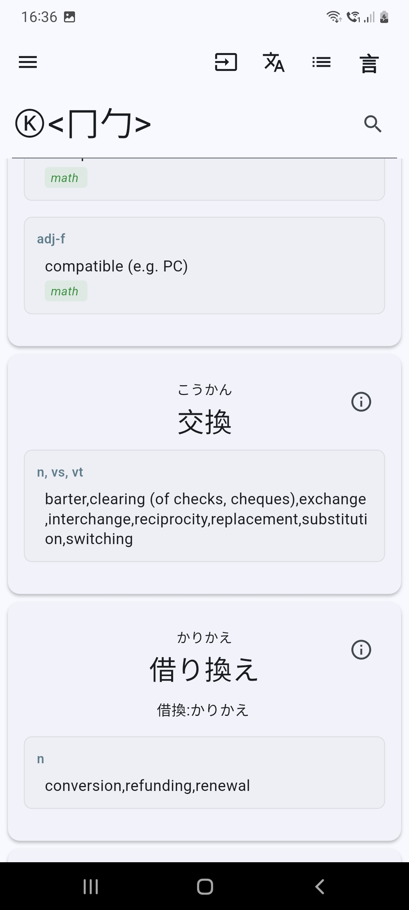
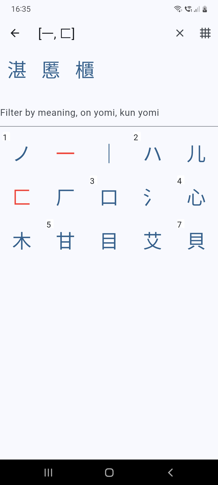
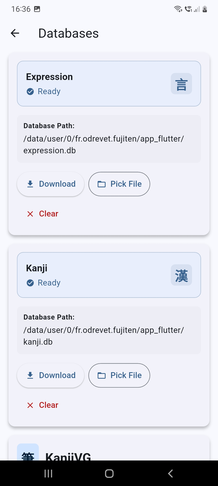

# Fujiten

**Fujiten** is an **offline Japanese dictionary app** built with the **Flutter** framework.  
It provides fast and reliable access to Japanese definitions and kanji information, all available offline.

Dictionary data is sourced from the **EDICT** project, compiled as a database via the [edict_database](https://github.com/odrevet/edict_database) repository.

---

[](https://f-droid.org/packages/fr.odrevet.fujiten/)
[](https://play.google.com/store/apps/details?id=fr.odrevet.fujiten)

Or download the latest APK from the [**Releases Section**](https://github.com/odrevet/fujiten/releases/latest).

---

# Screenshots

<p align="center">
  
  
  
</p>

---

# Setup

Fujiten requires two databases to function properly:
- **Expression Database**
- **Kanji Database**

You can download and install these databases directly from Fujiten via **Settings → Databases**,  
or manually from the [edict_database repository](https://github.com/odrevet/edict_database).

---

# Top Menu

## Bars
Opens the **Settings menu**, where you can:
- Download or update dictionaries
- Adjust brightness
- Read legal information

## Insert

| Icon | Function | Description |
|------|-----------|-------------|
| `<>` | **Radicals** | Finds kanji containing selected radicals |
| `Ⓚ` | **Kanji** | Matches any kanji character |
| `㋐` | **Kana** | Matches any hiragana or katakana character |
| `.*` | **Wildcard** | Matches any sequence (regular expression syntax) |

## Convert
If your device lacks a Japanese input keyboard, Fujiten can convert **romaji** (Latin characters) to kana:
- **Lowercase** → Hiragana
- **Uppercase** → Katakana

---

# Kotoba / Kanji Search

Switch between:
- **Kotoba** → Search for expressions or words
- **Kanji** → Search for kanji

### Buttons
- **Clear** → Erases the input field
- **Search** → Executes the search query

---

# Tips

- Searches support **regular expressions** — use quantifiers (`{}`), wildcards (`.`), and other regex syntax.
- Use **radical search** (`<>`) when you don’t know the full kanji but recognize its components, e.g. `＜化＞`.
- If no results appear, try adding `.*` at the **beginning** or **end** of your search term.

---

### Command Line
```bash
flutter run --dart-define=FFI=true
```

# Platforms

When the dart flag FFI is true, sqflite_common_ffi will be used otherwise the sqflite package will
be used

* Using command line:

```bash
flutter run --dart-define=FFI=true
```

Desktop build must use FFI. The libsqlite3.so must be installed on the host.  

* Android studio configuration: 

```xml
<component name="ProjectRunConfigurationManager">
<configuration default="false" name="ffi" type="FlutterRunConfigurationType" factoryName="Flutter">
<option name="additionalArgs" value="--dart-define=FFI=true" />
<option name="filePath" value="$PROJECT_DIR$/lib/main.dart" />
<method v="2" />
</configuration>
</component>
```

# Regexp support

Some build of sqlite do not include the regexp extension, in this case matches must be made using 
the GLOB operator.  

# releases

Releases are built with: 

* Github release: 
```
flutter build apk --split-per-abi --dart-define=FFI=false
flutter build linux --dart-define=FFI=true --release
```

* Google play store: 

```
flutter build appbundle --dart-define=FFI=false
```
