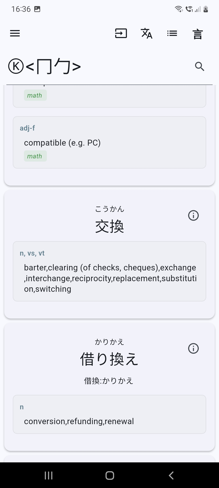
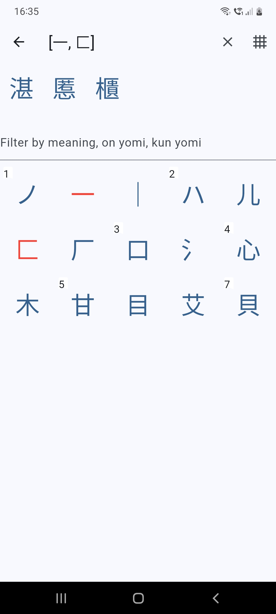
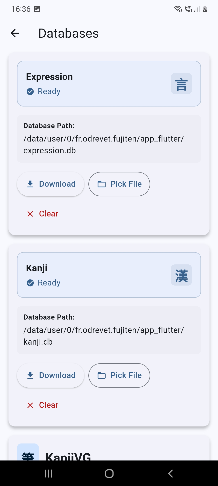

# Fujiten

**Fujiten** is an **offline Japanese dictionary app** built with the **Flutter** framework.  
It provides fast and reliable access to Japanese definitions and kanji information, all available offline.

Dictionary data is sourced from the **EDICT** project, compiled as a database via the [edict_database](https://github.com/odrevet/edict_database) repository.

---

| F-Droid | Google Play | GitHub Releases |
|:---:|:---:|:---:|
| [](https://f-droid.org/packages/fr.odrevet.fujiten/) | [](https://play.google.com/store/apps/details?id=fr.odrevet.fujiten) | [](https://github.com/odrevet/fujiten/releases/latest) |

* Download the latest APK from the [**Releases Section**](https://github.com/odrevet/fujiten/releases/latest).
* [](https://odrevet.github.io/fujiten/)


---

# Screenshots

<p align="center">
  
  
  
</p>

---

# Setup

Fujiten requires two databases to function properly:
- **Expression Database**
- **Kanji Database**

You can download and install these databases directly from Fujiten via **Settings → Databases**,  
or manually from the [edict_database repository](https://github.com/odrevet/edict_database).

---

# Top Menu

## Bars
Opens the **Settings menu**, where you can:
- Download or update dictionaries
- Adjust brightness
- Read legal information

## Insert

| Icon | Function | Description |
|------|-----------|-------------|
| `<>` | **Radicals** | Finds kanji containing selected radicals |
| `Ⓚ` | **Kanji** | Matches any kanji character |
| `㋐` | **Kana** | Matches any hiragana or katakana character |
| `.*` | **Wildcard** | Matches any sequence (regular expression syntax) |

## Convert
If your device lacks a Japanese input keyboard, Fujiten can convert **romaji** (Latin characters) to kana:
- **Lowercase** → Hiragana
- **Uppercase** → Katakana

---

# Kotoba / Kanji Search

Switch between:
- **Kotoba** → Search for expressions or words
- **Kanji** → Search for kanji

### Buttons
- **Clear** → Erases the input field
- **Search** → Executes the search query

---

# Tips

- Searches support **regular expressions** — use quantifiers (`{}`), wildcards (`.`), and other regex syntax.
- Use **radical search** (`<>`) when you don’t know the full kanji but recognize its components, e.g. `＜化＞`.
- If no results appear, try adding `.*` at the **beginning** or **end** of your search term.

---

### Command Line
```bash
flutter run --dart-define=FFI=true
```

# Platforms

When the dart flag FFI is true, sqflite_common_ffi will be used otherwise the sqflite package will
be used

* Using command line:

```bash
flutter run --dart-define=FFI=true
```

Desktop build must use FFI. The libsqlite3.so must be installed on the host.  

* Android studio configuration: 

```xml
<component name="ProjectRunConfigurationManager">
<configuration default="false" name="ffi" type="FlutterRunConfigurationType" factoryName="Flutter">
<option name="additionalArgs" value="--dart-define=FFI=true" />
<option name="filePath" value="$PROJECT_DIR$/lib/main.dart" />
<method v="2" />
</configuration>
</component>
```

## Web

The web build only supports the **Postgres** backend (local SQLite databases and KanjiVG are not
available on web). Configure your Supabase URL and anon key in **Settings → Databases**.

```bash
flutter build web
```

### Testing the web build locally

Serve the `build/web` directory with a static server, e.g. using `dhttpd`:

```bash
dart pub global activate dhttpd
~/.pub-cache/bin/dhttpd --path build/web --port 8080
```

Then open http://localhost:8080 in your browser.

# Search modes

Each database (expression and kanji) has an independent search mode, configurable in
**Settings → Search Options**:

* **Raw** — the input is matched literally (substring). No wildcard expansion.
* **Regexp** — POSIX regular expression matching.
* **Glob** — SQL `GLOB` wildcard matching (`*`, `?`).

Only the modes supported by the active backend are shown. Some builds of SQLite do not include
the regexp extension, in which case regexp matching is unavailable and GLOB must be used.

# releases

Releases are built with: 

* Github release: 
```
flutter build apk --split-per-abi --dart-define=FFI=false
flutter build linux --dart-define=FFI=true --release
flutter build web --release
```

* Google play store: 

```
flutter build appbundle --dart-define=FFI=false
```


# Database support

| Feature | Desktop: SQLite (FFI) | Android: SQLite | All: PostgreSQL |
|---------|-----------------------|----------------------------------------------------|-----------------|
| Raw     | Yes                   | Yes                                                | Yes             |
| Regexp  | No                    | Yes                                                | Yes             |
| Glob    | Yes                   | Yes                                                | No              |


